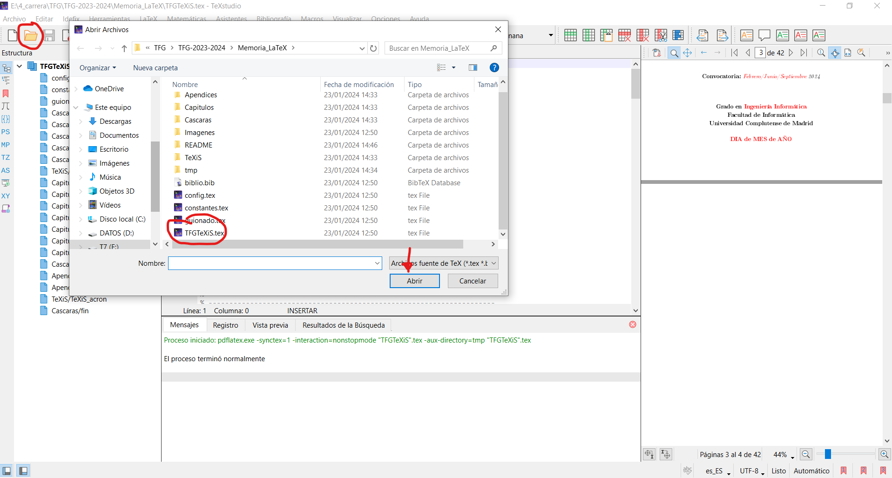
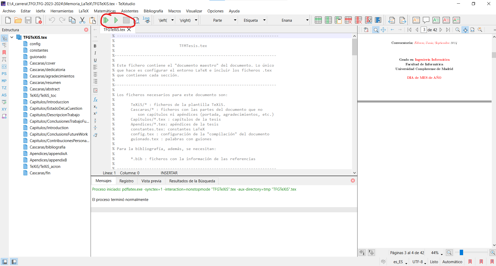
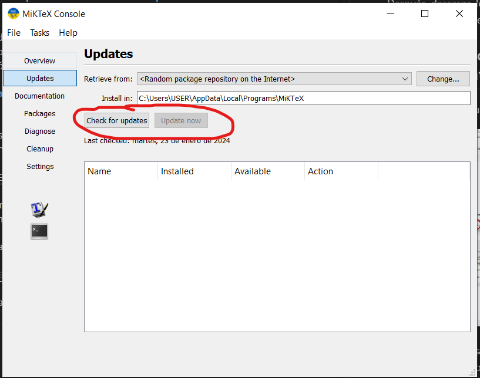
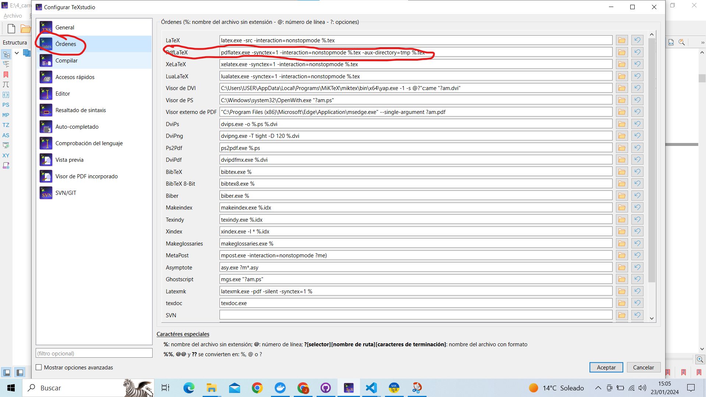

# Instrucciones de configuracion de MikTeX y TeXstudio

## Instalación

Puedes descargar MiKTeX [aquí](https://miktex.org/download), con seguir el proceso de instalación por defecto se instalará correctamente.

Después, descarga TeXstudio [aquí](https://www.texstudio.org/) después de instalar MiKTeX. Sigue el proceso de instalación por defecto también

## Instalacíon/actualización de paquetes y compilación del documento

Desde TeXstudio, pulsa en abrir y selecciona TFGTeXiS.tex para abrir

Dale a compilar, te saldrá una ventana que te pregunta si quieres instalar ciertos paquetes, deselecciona la casilla de Always Show this Window y dale a aceptar (no tengo captura para esto)

Después, aún no compilará, tendrás que abrir MiKTeX Console y darle a search for updates y después a update

Por último, antes de compilar, añade lo siguiente en la configuración de TeXstudio (Opciones->Configurar TeXstudio)

